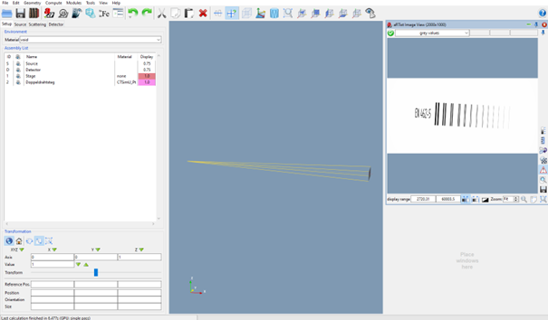

Features
========

In its current version, the toolbox can be used for the following tasks:

Image conversion
----------------
For image conversion, an "empty" `ctsimu.processing.pipeline` can be used. The following properties can be converted:

* Image format conversion (RAW, TIFF),
* Data type conversion (int, float),
* Representation conversion (multi-file slice stacks, single-file RAW volume chunks).

 For details, refer to the documentation of the `ctsimu.processing` module.

Image processing
----------------
For image processing, processing steps can be added to the pipeline. Currently, there are processing steps for

* Flat-field and dark-field correction with provided gain/offset files,
* Pixel binning,
* Median filter,
* Transformations: rotations, flipping.

You can find out more in the documentation of the `ctsimu.processing` module.

Image quality assessment
------------------------
The `ctsimu.image_analysis` module currently provides functions for:

* Line profiles,
* `ctsimu.image_analysis.mtf`: Calculation of the modulation transfer function (MTF) from an edge image,
* `ctsimu.image_analysis.isrb`: Determination of the interpolated basic spatial resolution (iSRb) from a duplex wire image.

Geometry tools
--------------
The `ctsimu.geometry` module provides tools for

* Virtual representation and manipulation of a CT scene in Python,
* Importing CT geometries from [CTSimU scenario description files],
* Creation of reconstruction configurations for openCT (VGSTUDIO) and CERA,
* Calculation of projection matrices.

[CTSimU scenario description files]: https://bamresearch.github.io/ctsimu-scenarios


Getting started
===============

Requirements
------------
A **Python 3** environment (Python 3.8 or higher) is required. The Python distribution that was used to develop and test the toolbox is *Anaconda 3* (available for Windows, macOS and Linux), and therefore a recommendation if you don't know where to start. The following Python packages are required as well. They usually come with a Python environment, or can be installed there easily:

* NumPy,
* SciPy subpackages *ndimage, optimize, stats, signal* and
* Matplotlib (only required if you want plots of evaluation results).


Installation
------------

If you want to **install** the package in your Python environment, you can use [pip]. For example, you can run the following command in your *Anaconda Prompt* to make the toolbox available:

	pip install ctsimu

[pip]: https://pip.pypa.io

To use the package **without installation**, you need to download the package manually. You have the following three options:

* Download the package [from PyPi]. You will get a zipped file called `ctsimu-X.X.X.tar.gz` (where X.X.X is the current version number). Open or unpack this file to get to its contents.
* Download the repository [from GitHub]: press the *clone* button to download a ZIP file. Unpack it or open it to see its contents.
* You can also clone the repository from GitHub via the terminal:

	`git clone https://github.com/BAMresearch/ctsimu-toolbox.git`

From any of these three options, you will get the complete package source code. It contains a folder called `ctsimu`. If you want to use the toolbox from your Python scripts without installing it, you need to copy the folder `ctsimu` to the location of your Python scripts to make the package available.


[from GitHub]: https://github.com/BAMresearch/ctsimu-toolbox
[from PyPi]: https://pypi.org/project/ctsimu/


Usage - Example of a test implementation
========================================

The individual tests are carried out using JSON files in a Python console. There are two JSON files. First, a JSON file describes what is to be simulated and how. It also refers to the files located in the same folder, the STL file for the geometry, and the CSV and XRS files for the spectrum description. These files are used to run a simulation. After each simulation, a `X._metadata.json` file must be generated (where X. is the current test, detector, subtest and the date of last changed JSON file). This file contains information about the results, what they are and where they are located. With this results file, the test can be started and carried out in the CTSimU toolbox. The following is a step-by-step guide as an example of a test to determine the detector unsharpness.

Simulation for CTSimU in a_RT_ist
---------------------------------

In this example, a double wire bar measurement (the test name is 2D-DW-1) is presented to determine the detector unsharpness. Here, the simulation software a_RT_ist is used to create the necessary projection images for the test. For this, the appropriate CTSimU module must be downloaded and installed for a_RT_ist. Theoretically, another simulation programme could also be used. Instructions on how to install and operate the module as well as the relevant ARTP installation file can be found on the [BAM research website](https://github.com/BAMresearch/ctsimu-artist-module). 

The prerequisite is that the scenario in this example is configured correctly in a_RT_ist. The following files should be in one folder: `2D-DW-1_Detektor1_2021-05-26v01r01dp.json` file, the STL of the double wire path and the two files (TXT and XRS) for the description of the spectrum. The JSON file can then be loaded into a_RT_ist. The scenario is now visible in a_RT_ist and can be started with **Run scenario**. Now the finished projection is visible in the Image Viewer ([fig][aRTist scene for DW_1-test]) and in the folder of the JSON file a new folder with the name `2D-DW-1_Detektor1_2021-05-26v01r01dp` with a subfolder `projections` is created.

There are contained: 
* two TIF files, a projection image of the double wire bar according to EN462-5 and the corresponding flatfield image (background noise image). 
* a Python program (`2D-DW-1_Detektor1_2021-05-26v01r01dp_flat.py`) which includes the code for the flatfield correction.
* the CTSimU module outputs to a `X._metadata.json` file (e.g.: 2D-DW-1_Detector1_2021-05-26v01r01dp_metadata.json).

	The `X._metadata.json` file contains all important information of the two projections and is used for the test execution. Since detector1 has a resolution in the range of 75müm, the subtest SR75 is used. For detector2, the subtest SR150 is used, as a spatial resolution of 150microns is also expected.



CTSimU Toolbox Test Execution from the Python Console
-----------------------------------------------------

The test "Double Wire Ridge - Detector Unsharpness" can be found at [BAM research website in CTSimu Evaluation](https://github.com/BAMresearch/ctsimu-toolbox/tree/main/ctsimu/ctsimu_evaluations) with the name `test2D_DW_1.py`. In this Python file, the test name "2D-DW-1" and thus also input name for the Python console can be found in line 43 (as testName="2D-DW-1").


```python
36 class Test2D_DW_1(generalTest):
37	""" CTSimU test 2D-DW-1: Detector Unsharpness. """
38
39	def __init__(self, resultFileDirectory=".", name=None, rawOutput=False):
40
41		generalTest.__init__(
42			self,
43			testName="2D-DW-1",
44			name=name,
45			nExpectedRuns=2,
46			resultFileDirectory=resultFileDirectory,
47          rawOutput=rawOutput)

```

The names of the sub-tests can be read in line 80 with "SR75" and in line 82 with "SR150".

```python
77 def prepareRun(self, i):
78    if i < len(self.subtests):
79        self.jsonScenarioFile = "scenarios/2D-DW-1_Detektor1_2021-05-26v01r01dp.json"
80        if self.subtests[i] == "SR75":
81            self.jsonScenarioFile = "scenarios/2D-DW-1_Detektor1_2021-05-26v01r01dp.json"
82        elif self.subtests[i] == "SR150":
83            self.jsonScenarioFile = "scenarios/2D-DW-1_Detektor2_2021-05-26v01r01dp.json"
```

This is similarly structured in the other tests. In some of them there are no sub-tests.

The tests SR75 and SR150 are the same only they are stored according to their names, here according to the expected spatial resolution. Since we know in advance in which range the resolution is, we can directly choose the test with the appropriate name. In this way, a suitable name is created for the resulting data. Detector1 should have a spatial resolution of iSRb = 75 microns and Detector2 should have iSRb = 150 microns.

Running the 2D-DW-1 test in a Python console:

To run the 2D-DW-1 test, the generated ..._metadata.json file from a_RT_ist is used. The test commands are then executed in the Python console in the following way. 1: 

1.	after opening the Python console, the library ctsimu.toolbox must first be imported:

	from ctsimu.toolbox import Toolbox

2.	for a partial test:

	Toolbox("2D-DW-1", SR75 = "\\2D-DW-1 - Doppeldrahtsteg - Detektorunschaerfe\\2D-DW-1_Detektor1_2021-05-26v01r01dp\\projections\\2D-DW-1_Detektor1_2021-05-26v01r01dp_metadata.json")

3.	Both partial tests directly one after the other:

	Toolbox("2D-DW-1", SR75 = "S:\\X.\\CTsimu\\2D-DW-1 - Doppeldrahtsteg - Detektorunschaerfe\\2D-DW-1_Detektor1_2021-05-26v01r01dp\\projections\\2D-DW-1_Detektor1_2021-05-26v01r01dp_metadata.json", SR150 = "S:\\X.\\CTsimu\\2D-DW-1 - Doppeldrahtsteg - Detektorunschaerfe\\2D-DW-1_Detektor2_2021-05-26v01r01dp\\projections\\2D-DW-1_Detektor2_2021-05-26v01r01dp_metadata.json")


After execution, two folders are saved in the same path of the ..._metadata.json file. In the folder "corrected" the flatfield corrected image is saved and in the "2D-DW-1-results"-folder grey value profiles resp. grey value distribution and each the result for the basic spatial resolution (iSRb) of a detector are given with the corresponding measurement values (wire spacing [mm] modulation depth [%]) as well as the values of the interpolation function are saved in .txt-files. In addition, the corresponding plots are displayed as .png images (see ABB):
* a histogram (grey value distribution over the horizontal distance in pixels)
* a plot of the spatial resolution of the investigated detector with interpolation function and the determined iSRb value (modulation depth [%] over the wire distance [mm]):


About
=====

The CTSimU toolbox was developed for the [CTSimU] project for its needs in reproducible image processing and serves as the project's reference software implementation. It provides useful tools for many CT-related tasks, beyond the aims of the CTSimU project.

The software is released under the **Apache 2.0 license,** its source code is available [on GitHub].

[on GitHub]: https://github.com/BAMresearch/ctsimu-toolbox

Acknowledgements
----------------
This work was funded through the project [CTSimU] (*Radiographic Computed Tomography Simulation for Measurement Uncertainty Evaluation*, WIPANO project 03TNH026A).

[WIPANO] projects are financed by the German [Federal Ministry for Economic Affairs and Climate Action] and managed by [Project Management Jülich].

[CTSimU]: https://www.ctsimu.forschung.fau.de/
[WIPANO]: https://www.innovation-beratung-foerderung.de/INNO/Navigation/DE/WIPANO/wipano.html
[Federal Ministry for Economic Affairs and Climate Action]: https://www.bmwi.de/
[Project Management Jülich]: https://www.ptj.de/

Contributors
------------
The following people contributed to code and documentation of the toolbox.

* David Plotzki
* Bendix Hartlaub
* Florian Wohlgemuth
* Tamara Reuter
* Fabrício Borges de Oliveira
* Carsten Bellon