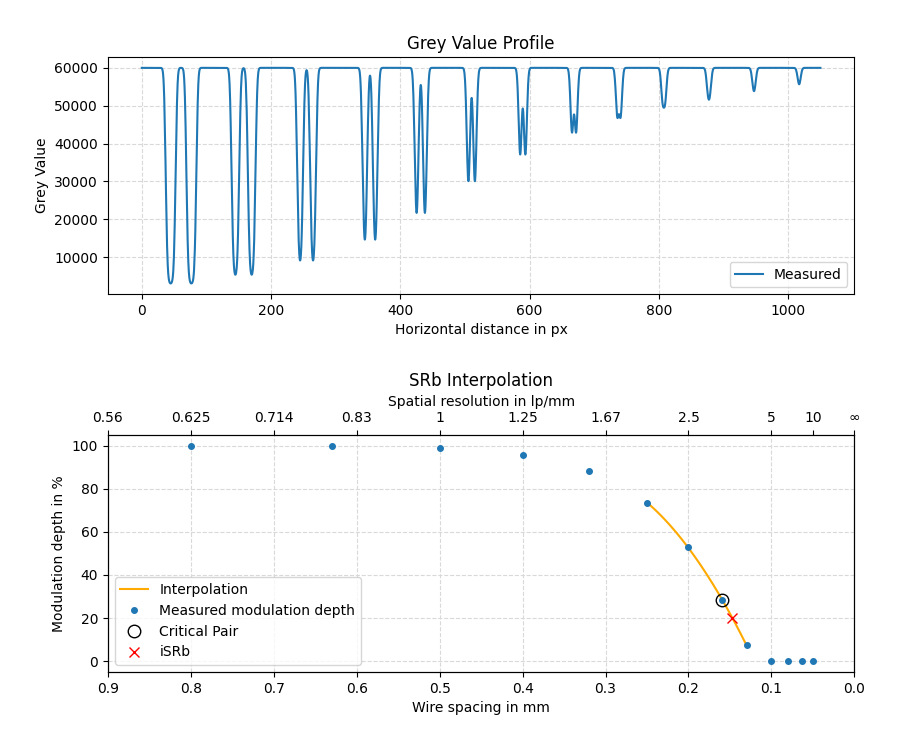

This test employs a sample of duplex wires (DIN EN 462-5 or [ISO 19232-5]) to check if the required basic spatial resolution (SR<sub>b</sub>) is simulated correctly. It uses the technique presented in [ASTM E2002-15] to calculate the interpolated basic spatial resolution (iSR<sub>b</sub>) using a line profile across the duplex wires sample.

[ISO 19232-5]: https://dx.doi.org/10.31030/2857038
[ASTM E2002-15]: https://doi.org/10.1520/E2002

This scenario defines two subtests: one with a basic spatial resolution of SR<sub>b,1</sub> = 75 &mu;m, and a second one with SR<sub>b,2</sub> = 150 &mu;m. The following code example shows how to identify each sub-test correctly when using the toolbox with metadata files to run the evaluation.

```python
from ctsimu.toolbox import Toolbox
Toolbox("2D-DW-1",
    SR75  = "2D-DW-1_75um_metadata.json",
    SR150 = "2D-DW-1_150um_metadata.json"
)
```

A line profile is measured perpendicular to the duplex wires at a tilt angle of 3&deg;, with a line width of *w* = 20 px and a resolution of *r* = 0.1 px. The profile has a length of *l* = 1050 px; its start and end point are given and illustrated in the following picture.


The evaluation follows the procedure described in [ASTM E2002-15] to calculate the interpolated basic spatial resolution (iSR<sub>b</sub>). The modulation depth is measured for each wire pair, defined as the ratio of the height of its central peak above the two dips to the depth of its dips against the background intensity. For the interpolation, a quadratic function is fit to the last point that has a modulation depth of more than 20% and its neighborhood of nearest and next-nearest neighbors, as long as they have a modulation depth of at least 1.5%.



The upper picture shows an example for a line profile across the duplex wire pairs at a simulated basic spatial resolution of SR<sub>b,2</sub> = 150 &mu;m for a pixel size of 50 &mu;m.

The lower picture shows the identified modulation depths as a function of the wire spacing. The dotted line shows the quadratic interpolation function, the cross designates the interpolated iSR<sub>b</sub> = 147 &mu;m at a modulation depth of 20%.